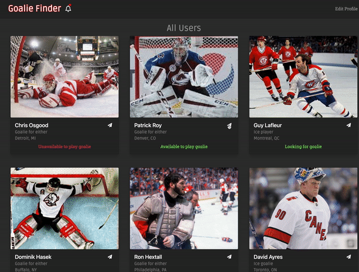
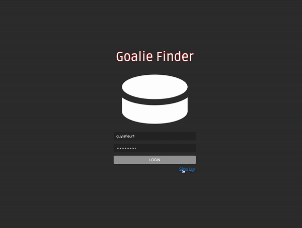
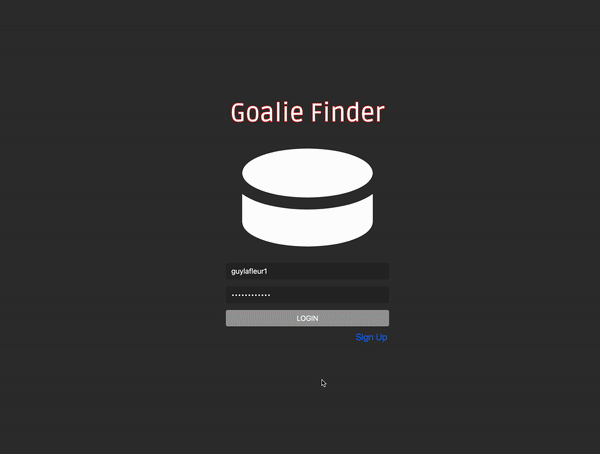

# Goalie Finder

A full stack web application for ice and roller hockey players to find goalies

## Technologies Used
  * React
  * Socket.IO
  * React Bootstrap
  * JavaScript
  * Node.Js
  * Express.Js
  * postgreSQL
  * HTML5
  * babel
  * npm
## Try it
[Goalie Finder](https://stevebehm.github.io/WriteOn/)
## Features
  * User can sign up
  * User can create a profile
  * User can login
  * User can view a list of other current users
  * User can edit their profile
  * User can chat with other user in real-time
  * User can see previous messages between other user and them
  * User can see notifications for missed messages
  * User can follow a notification to chat with that user
  * User can notify other user of unread message when other user is not in chat
## Strecth Features
  * User can filter list of other users based on availability
  * User can sign out of account
## Preview
  
  
  
## Getting Started
1. Clone the repository.

```shell
git clone https//github.com/SteveBehm/WriteOn.git
cd WriteOn
```

2. Install all dependencies with NPM.

```shell
npm install
```

3. Begin coding, making sure to open index.html in your default browser to check your work.
